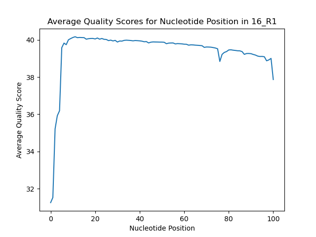
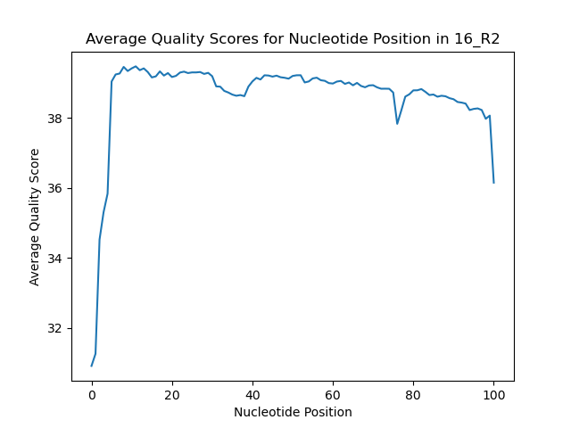
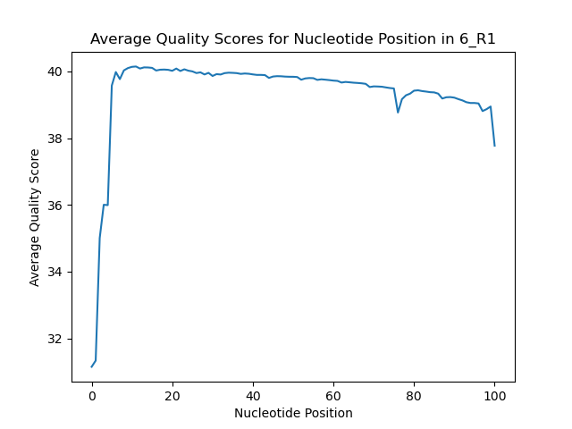
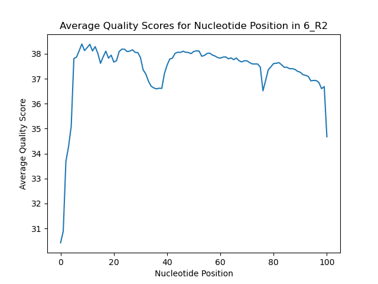
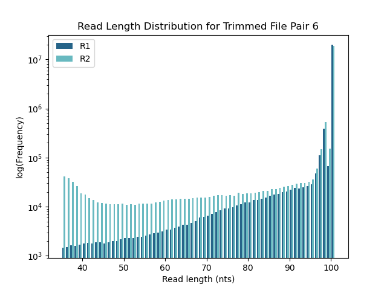
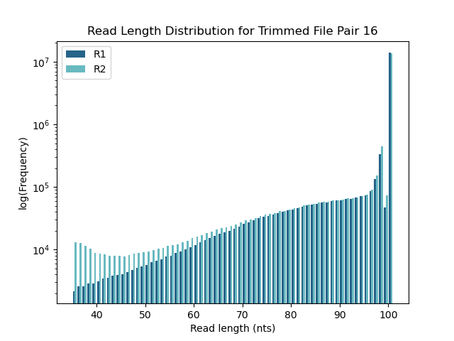

# BI623 RNA-seq Quality Assessment Assignment - Lab Notebook
Jules Hays
## Due: 9/13/24

Python version: 3.12.5

Environments used: QAA (fastqc 0.12.1, cutadapt 4.9, trimmomatic 0.39, matplotlib 3.9.2, star 2.7.11b, numpy 2.1.0, htseq 2.0.5)

__File directory__

Python scripts:
* qual_dist.py - plots the quality score per base of reads (Part 1)
* read_len_dist.py - plots the read length dist of paired trimmed and filtered reads (Part 2)
* sam_parse.py - counts the number of mapped and unmapped reads from the STAR alignment output SAM files (Part 3)

sbatch scripts:
* run_qual_dist.sh - runs qual_dist.py for each file in both pairs (Part 1)
* run_cutadapt.sh - runs cutadapt, once per pair, to cut adaptor regions from the reads (Part 2)
* run_trimmomatic.sh - runs trimmomatic, once per pair, to cut low quality regions from the reads (Part 2)
* run_readlen_dist.sh - runs read_len_dist.py, once per pair (Part 2)
* run_star_genomegen.sh - runs STAR genomeGenerate once to generate an alignment database from the Mus Musculus genome (Part 3)
* run_star_align.sh - runs STAR alignReads once per pair to align the filtered and trimmed reads to the generated database (Part 3)
* run_htseq.sh - runs htseq-count, once stranded for each pair and once reverse stranded for each pair, to count the reads that map to features (Part 3)


---
### 8/24/24
Despite Leslie telling me not to be scared, I'm scared.

I logged into Talapas, navigated to my Bi623 directory, and cloned the repository. The repository is located at the following path:
```
/projects/bgmp/jkhay/bioinfo/Bi623/QAA
```
I then copied the Github QAA repo using my GitHub token. The repo is found at the following link: https://github.com/julhays/QAA

I started an interactive session on Talapas:
```
$ srun --account=bgmp --partition=bgmp --time=3:00:00 --pty bash
```

Next I am going to locate my data. The assignments for the demultiplexed file pair I will be working with is located in a file that I viewed with the following command:
```
cat /projects/bgmp/shared/Bi623/QAA_data_assignments.txt
```

Copying and pasting from this file, my assignments are the following:
```
Jules   16_3D_mbnl_S12_L008     6_2D_mbnl_S5_L008
```
These 2 files should each have a read 1 and read 2 of the index - a total of 4 files to analyze.

The files are located at the followng paths, with an arrow pointing to what I will refer to each graph as in my file naming:
```
/projects/bgmp/shared/2017_sequencing/demultiplexed/16_3D_mbnl_S12_L008_R1_001.fastq.gz -> 16_R1
/projects/bgmp/shared/2017_sequencing/demultiplexed/16_3D_mbnl_S12_L008_R2_001.fastq.gz -> 16_R2
/projects/bgmp/shared/2017_sequencing/demultiplexed/6_2D_mbnl_S5_L008_R1_001.fastq.gz -> 6_R1
/projects/bgmp/shared/2017_sequencing/demultiplexed/6_2D_mbnl_S5_L008_R2_001.fastq.gz -> 6_R2
```
As per the instruvtions, I will not move, copy or unzip the files and instead will reference them by path and use zcat. Lets perform some initial data exploration.

File size:
```
$ ls -lah /projects/bgmp/shared/2017_sequencing/demultiplexed/
-rw-r-----+ 1 coonrod is.racs.pirg.bgmp 468M Sep  1  2020 16_3D_mbnl_S12_L008_R1_001.fastq.gz
-rw-r-----+ 1 coonrod is.racs.pirg.bgmp 452M Aug 23  2017 16_3D_mbnl_S12_L008_R2_001.fastq.gz
-rw-r-----+ 1 coonrod is.racs.pirg.bgmp 571M Aug 23  2017 6_2D_mbnl_S5_L008_R1_001.fastq.gz
-rw-r-----+ 1 coonrod is.racs.pirg.bgmp 653M Aug 23  2017 6_2D_mbnl_S5_L008_R2_001.fastq.gz
```
Ok they are each about 400-600 Mb zipped.

Find number of lines:
```
$ zcat /projects/bgmp/shared/2017_sequencing/demultiplexed/16_3D_mbnl_S12_L008_R1_001.fastq.gz | wc -l
    32940788
$ zcat /projects/bgmp/shared/2017_sequencing/demultiplexed/16_3D_mbnl_S12_L008_R2_001.fastq.gz | wc -l
    32940788
$ zcat /projects/bgmp/shared/2017_sequencing/demultiplexed/6_2D_mbnl_S5_L008_R1_001.fastq.gz | wc -l
    44112976 
$ zcat /projects/bgmp/shared/2017_sequencing/demultiplexed/6_2D_mbnl_S5_L008_R2_001.fastq.gz | wc -l
    44112976
```
Divide these by 4 to get number of records:
```
16_3D_mbnl_S12_L008 - 8,235,197
6_2D_mbnl_S5_L008 - 11,028,244
```
The R1 and R2 files for each pair have the same number of lines/records, which is a good sign.

Read length:
```
$ zcat <filename> | sed -n '2~4p' | awk '{print length($0)}' | uniq
```
They all have a read length of 101 which is what was expected.

I also checked the Phred encoding on each file by running the following command for each file
```
zcat <filepath> | sed -n '4~4p' | head
```
Since all files contained symbols like '#' and '<', it is Phred+33 encoding.

In addition to these stats, I also investigated the headers of my files to see what the barcodes were and if they were quality filtered when they were demultiplexed.
```
$zcat /projects/bgmp/shared/2017_sequencing/demultiplexed/16_3D_mbnl_S12_L008_R1_001.fastq.gz | head
@K00337:83:HJKJNBBXX:8:1101:4797:1191 1:N:0:NCGATCAG+NTGATCGT
$ zcat /projects/bgmp/shared/2017_sequencing/demultiplexed/16_3D_mbnl_S12_L008_R2_001.fastq.gz | head
@K00337:83:HJKJNBBXX:8:1101:4797:1191 2:N:0:NCGATCAG+NTGATCGT
$ zcat /projects/bgmp/shared/2017_sequencing/demultiplexed/6_2D_mbnl_S5_L008_R1_001.fastq.gz | head
@K00337:83:HJKJNBBXX:8:1101:1935:1191 1:N:0:NAGCCATG+NATGGCTA
$ zcat /projects/bgmp/shared/2017_sequencing/demultiplexed/6_2D_mbnl_S5_L008_R2_001.fastq.gz | head
@K00337:83:HJKJNBBXX:8:1101:1935:1191 2:N:0:NAGCCATG+NATGGCTA
```
It appears that the barcodes for both sets of my files contain an N, so the barcodes were not thrown out for containing an N like how we demultiplexed the files. This likely means the barcodes weren't quality checked either, so these could potentially be low quality barcodes.

Below is a summary table of my initial data analysis:

| File | size (M) | # lines | # records | read_len | Phred encoding | fw_barcode | rev_barcode
|---|---|---|---|---|---|---|---|
| 16_R1 | 468 | 32,940,788 | 8,235,197 | 101 | Phred+33 | NCGATCAG | NTGATCGT |
| 16_R2 | 452 | 32,940,788 | 8,235,197 | 101 | Phred+33 | NCGATCAG | NTGATCGT |
| 6_R1 | 571 | 44,112,976  | 11,028,244 | 101 | Phred+33 | NAGCCATG | NATGGCTA |
| 6_R2 | 653 | 44,112,976  | 11,028,244 | 101 | Phred+33 | NAGCCATG | NATGGCTA |


The files look good to continue with quality analysis.


### Part 1 - Read quality score ditributions
Goal: Install and use FastQC for quality assessment of demultiplexed RNA-seq files, compare the quality assessments to those from my own software.

I started an interactive session on Talapas:
```
$ srun --account=bgmp --partition=bgmp --time=3:00:00 --pty bash
```

I made a new conda environment called ```QAA``` and installed FastQC into it with the following commands:
```
$ conda create --name QAA python=3.12
$ conda activate QAA
$ conda install fastqc
$ fastqc --version                    
FastQC v0.12.1
```

Time to use FastQC. I will use the following FastQc manual and tutorial for help:

https://home.cc.umanitoba.ca/~psgendb/doc/fastqc.help

https://hbctraining.github.io/Intro-to-ChIPseq/lessons/02_QC_FASTQC.html

First we will use FastQC to make graphs about each fastq file such as a per-base quality score distribution for R1 and R2 reads of each pair, and per-base N content for each file.

I will run fastqc on all 4 files:
```
/usr/bin/time -v fastqc -o fastqc_out -t 4 /projects/bgmp/shared/2017_sequencing/demultiplexed/16_3D_mbnl_S12_L008_R1_001.fastq.gz /projects/bgmp/shared/2017_sequencing/demultiplexed/16_3D_mbnl_S12_L008_R2_001.fastq.gz /projects/bgmp/shared/2017_sequencing/demultiplexed/6_2D_mbnl_S5_L008_R1_001.fastq.gz /projects/bgmp/shared/2017_sequencing/demultiplexed/6_2D_mbnl_S5_L008_R2_001.fastq.gz
```
The -t specifies the number of cores which my source said to do 1 per file, which is why I did 4. -o specifies the name of the output directory.

It ran succesfully and took 2 minute 49 seconds and 99% CPU to run all 4 files. My fastqc outputs for each file are located in ```fastqc_out``` directory. I unziped each of the zip files into their own directories, 1 for each file named after the file, using the following commands:
```
$ unzip fastqc_out/16_3D_mbnl_S12_L008_R1_001_fastqc.zip
$ unzip fastqc_out/16_3D_mbnl_S12_L008_R2_001_fastqc.zip
$ unzip fastqc_out/6_2D_mbnl_S5_L008_R1_001_fastqc.zip 
$ unzip fastqc_out/6_2D_mbnl_S5_L008_R2_001_fastqc.zip 
```

Below I will paste the resulting plots for each file.

| File name | per_base_qual | per_base_n |
|---|---|---|
| 16_R1 |  |  |
| 16_R2 |  |  |
| 6_R1 |  |  |
| 6_R2 |  |  |

The per base quality score distribution is consistant with the per base n content plot in all 4 files because there's a small spike in n content at the beginning of the reads and it looks like the quality score of the beginning the reads is lower than the rest of the read.

Now, I will run these files through my own script ```qual_dist.py``` to calculate quality score distribution to see if it is similar to FastQC's distribution. To do this, I copied the python script I used to do this, plus the slurm script to run it, in the Demultiplex assignment using the below commands. I also needed bioinfo.py since my script used it for the ```convert_phred``` function.
```
$ cp /projects/bgmp/jkhay/bioinfo/Bi622/
Demultiplex/Assignment-the-first/qual_dist.py .
$ cp /projects/bgmp/jkhay/bioinfo/Bi622/Demultiplex/Assignment-the-first/R1_dist.sh .
$ cp /projects/bgmp/jkhay/bioinfo/Bi622/Demultiplex/Assignment-the-first/bioinfo.py .
```
I am going to read through these scripts to make sure no changes need to be made to suit my purposes. I changed the name of the R1_dist.sh to ```run_qual_dist.sh``` because I am going to use to to run all my files through at once since they aren't as big as the files we had in Demux. I changed one thing - my naming scheme for my graph output was different in the Demux assignment and I had just used a regex to get if the file was R1, R2, R3, or R4. Since this is no longer applicable i am just going to add another argparse parameter for the output file name and title of the distribution plot.

Time to run  ```run_qual_dist.sh```.
```
$ sbatch run_qual_dist.sh 
Submitted batch job 15875460
```
It succesffully ran, but it took a long time. If I do this again I will use 4 separate slurm scripts so I can run all 4 files in parallel. It took about 4-6 minutes per file for a total of 20 minutes and 8 seconds. Each run took about 99% CPU. The err and out files are in my ```Logs``` directory.

Below is a table to compare the per base average quality score of the 4 files:
| File name | fastq_per_base_qual | my_per_base_qual |
|---|---|---|
| 16_R1 |  |  |
| 16_R2 |  |  |
| 6_R1 |  |  |
| 6_R2 |  |  |

Here is a summary of runtime stats:
| Method | Runtime | Number of Cores | CPU Usage |
|---|---|---|---|
| FastQC | 2 minutes 49 seconds | 4 | 99% |
| qual_dist.py | 20 minutes 8 seconds | 8 | 99% |

The quality score distribution plots look very similar between the 2 methods. One obvious difference between the 2 plots is the the FastQC generated plot it gives more information about the distribution of quality scores for each nucleotide position than my plot. The red line shows the median, the yellow box shows the IQR, the upper and lower wisker give the 10% and 90% points, and the blue line gives the mean [1]. My plot only shows the mean for a given position, so I can compare the blue "mean" line with my plots. The lines for means appear to follow the same pattern, spiking and dipping in the same nucleotide positions, the dips and spikes are just less dramatic in the FastQC plots because the y-axis ranges from 0 to 30 whereas mine ranges from 30 to 40. The FastQC plots also show some guidelines with the red, orange, and green color zones to show what should be considered as a cutoff for 'good' quality, whereas my graph does not give any information about a cutoff. The FastQC plots are binned into 2 nucleotide groups, whereas my plots show a continuous distribution. This binning could potentially cause a loss of data. Finally, for my 4th file specifically, ```6_2D_mbnl_S5_L008_R2_001.fastq.gz```, the FastQC plot brings attention to some lower quality data: a dip in lower quartile/10% quality scores around bp 30-40, as well as a dip in lower quartile/10% quality at the end of the read from base pair 55 onwards. This means that there are some reads in the bottom 25% that are at or below the green cutoff of 28 in large sections of the read. My plot only shows the impact of these lower quality reads on the mean, which causes a small dip from about 38 to 36. I wouldn't think to throw out any reads based on my plot, but after seeing the FastQC  plot, I believe there are some lower quality reads in the ```6_2D_mbnl_S5_L008_R2_001.fastq.gz``` file that should be thrown out.

In terms of runtime, in addition to providing a more in depth analysis of the quality score distribution, FastQC also ran through all 4 files 10 times faster than my python script did (see above runtime comparison table). Additionally, the 2 methods used the same % of CPU but FastQC did so with half the number of cores as my script. Overall, FastQC provides a better analysis of quality distribution and is faster and more efficient.

Some reasons that FastQC might be so much better in performance and faster than my python script is FastQC is a java application [2], and java code runs faster than python code because java does not need go through an interpretation step like python does. Additionally, FastQC was first released in 2010 so has had many years and likely teams of people to optimize it, whereas my code was developed a couple weeks ago by 1 grad student who is new to bioinfomatics. Therefore, it makes sense why FastQC is better in every way.

source: [1] https://www.bioinformatics.babraham.ac.uk/projects/fastqc/Help/3%20Analysis%20Modules/2%20Per%20Base%20Sequence%20Quality.html
[2] https://www.bioinformatics.babraham.ac.uk/projects/fastqc/INSTALL.txt#:~:text=Installing%20FastQC%20%2D%2D%2D%2D%2D,Runtime%20Environment%20(JRE)%20installed.

In terms of the overall quality of my two libraries, I belive they are high enough quality to continue with further analysis. The per base quality for 3 of the 4 files looks great, with all the means and lower 10th percentiles in the green range. The file with a questionable per base quality, file 6_R2, the means are all in the green zone but the lower quartile and 10th percentile dip into the yellow zone. Therefore, there are some low quality reads in this file that will likely need to be trimmed out. In terms of per base n contenct, all four files look good. There is just a small increase less than a percent or two in N content at the beginning position of the read for each file but then it tapers off to close to 0%, but this it to be expected since the beginning of a read in Illumina will be slightly lower quality and have unknown calls as the machine orients itself. The per base sequence quality score plots also look good, increasing gradually from a quality score of 30 to 38, then spiking sharply up from 38-40. This shows that a majority of the reads have an average quality between 38 and 40, which is good. The only graph that is different in in 6_R2 the gradual increase starts at a score of 20, and then the graph spikes at a score of 36-40. This means that a majority of the reads for this file are between 36 and 40 and there's some reads below 30, which is consistant with the ber base quality for that file. The per base GC content distribtuion looks roughtly normal for all 4 files, indicating that the library was not biased. For sequence length distribution, all of the reads are 101 base pairs which is what was expected. There seems to be a lot of duplication within these files. For 6_R1 there is a spike in percentage of reads with >10 duplicates and when duduplicated, there will be 47% of the reads remaining. There is a similar spike in the remaining files, with percentages after deduplication of 58%, 59%, and 62% for 6_R2, 16_R1, and 16_R2, respectively. This duplication could indicate PCR overamplification for this RNA-seq library, but also isn't too much of a concern because it could also just be the the transcript was duplicated in the organism since its RNA data. Adaptor content is low for file pair 6, but spikes from bp 60 onwards for file pair 16. But this spike should be okay to continue with since adaptors will be removed in further processing.

Based on the results from all these plots, I recommend that these 2 files pairs are high enough quality to use for further analysis, which caution placed on file 6_R2 (```6_2D_mbnl_S5_L008_R2_001.fastq.gz```). It is likely that low quality reads will need to be trimmed out of this file based on the FastQC results.


Questions:
* did you do a quality cutoff to make these demuxed files?
 barcodes have N's, didn't throw barcodes out based on quality, I will add this to my data exploration


### Part 2 - Adaptor trimming comparison
Goal: Perform adaptor trimming with existing tools cutadapt and Trimmomatic. 

First, I will install cutadapt and Trimmomatic into my QAA conda environment:
```
$ mamba install cutadapt=4.9
$ cutadapt --version
4.9
$ mamba install trimmomatic=0.39
$ trimmomatic -version
0.39
```
Now I will use cutadapt to trim adaptor sequences from my files.

Based on some research it appears that Illumina TruSeq uses the following adaptors:

Read 1: AGATCGGAAGAGCACACGTCTGAACTCCAGTCA
Read 2: AGATCGGAAGAGCGTCGTGTAGGGAAAGAGTGT

source: https://support-docs.illumina.com/SHARE/AdapterSequences/Content/SHARE/AdapterSeq/TruSeq/UDIndexes.htm

Sanity check: I will use bash commands to find the adaptor sequences.
```
zcat /projects/bgmp/shared/2017_sequencing/demultiplexed/16_3D_mbnl_S12_L008_R1_001.fastq.gz | grep -c "AGATCGGAAGAGCACACGTCTGAACTCCAGTCA" | less -p
zcat /projects/bgmp/shared/2017_sequencing/demultiplexed/16_3D_mbnl_S12_L008_R2_001.fastq.gz | grep "AGATCGGAAGAGCGTCGTGTAGGGAAAGAGTGT"
```
Sanity check: Use your Unix skills to search for the adapter sequences in your datasets and confirm the expected sequence orientations. Report the commands you used, the reasoning behind them, and how you confirmed the adapter sequences.

only get adaptors in seq if insert is shorter than read len. If insert < 101, you will get adaptor seq on 3' end .


ADD MORE


I will use the following cutadapt command template:
```
cutadapt -a ADAPTER_FWD -A ADAPTER_REV -o out.1.fastq -p out.2.fastq reads.1.fastq reads.2.fastq
```
-a is the R1 adaptor sequence. -A is the R2 adaptor sequence. -o is the R1 output file. -p is the R2 output file. To run this on all my files, I put a command for each file pair into an sbatch script called ```run_cutadapt.sh``` and ran it.
```
$ sbatch run_cutadapt.sh 
Submitted batch job 15883794
```
The err and stout for this run is located in my ```Logs``` directory. The output files are located in the ```cutadapt_out``` directory.

Pair 16 Run Summary:
* 50 seconds to run, 6.166 µs/read
* used 98% CPU and 1 core
* Total read pairs processed: 8,235,197
* Read 1 with adapter: 1,002,983 (12.2%)
* Read 2 with adapter: 1,069,893 (13.0%)
* Pairs written (passing filters): 8,235,197 (100.0%)
* Total base pairs written (filtered):  1,627,540,628 bp (97.8%)
    * Read 1:   813,886,317/831,754,897 bp
    * Read 2:   813,654,311/831,754,897 bp
* Apdator 1 trimmed 1002983 times
* Adaptor 2 trimmed 1069893 times

Pair 6 Run Summary:
* 54 seconds to run, 4.904 µs/read
* used 98% CPU and 1 core
* Total read pairs processed: 11,028,244
* Read 1 with adapter: 416,045 (3.8%)
* Read 2 with adapter: 502,045 (4.6%)
* Pairs written (passing filters): 11,028,244 (100.0%)
* Total base pairs written (filtered):  2,220,049,445 bp (99.7%)
    * Read 1:   1,110,205,328/1,113,852,644 bp
    * Read 2:   1,109,844,117/1,113,852,644 bp
* Apdator 1 trimmed 416045 times
* Adaptor 2 trimmed 502045 times
	
---
### 8/26/24
### Part 2 cont
Now I will use Trimmomatic to quality trim my reads. I am going to write an sbatch script to run trimmomatic called ```run_trimmomatic.sh```.

I will use the following trimmomatic command template:
```
trimmomatic PE \
    <R1_file> <R2_file> \
    R1_paired_filtered.fastq.gz \
    R1_unpaired_filtered.fastq.gz \
    R2_paired_filtered.fastq.gz \
    R2_unpaired_filtered.fastq.gz \
    LEADING:3 \
    TRAILING:3 \
    SLIDINGWINDOW:5:15 \
    MINLEN:35
```
* PE specifies parired end files
* LEADING is the threshold to remove low quality bases from the beginning of a read
* TRAILING is the threshold to remove low quality bases from the end of a read
* SLIDINGWINDOW specific sliding window trimming, where is the average quality within a window of 5 nucleotides is below 15 it cuts them out
* MINLEN is the length cutoff to remove reads that are short after cutting from the file

I ran this script with the following command:
```
$ sbatch run_trimmomatic.sh 
Submitted batch job 15884020
```

The log output is in the ```Logs``` directory. The outputted files are in the ```trim_out``` directory.

16 Summary:
* used 4 threads and 211% CPU
* took 3 minutes 10 seconds
* Input Read Pairs: 8235197
* Both Surviving: 8014158 (97.32%)
* Forward Only Surviving: 189384 (2.30%)
* Reverse Only Surviving: 6913 (0.08%)
* Dropped: 24742 (0.30%)

6 Summary
* used 4 threads and 200% CPU
* took 4 minutes 23 seconds
* Input Read Pairs: 11028244
* Both Surviving: 10461303 (94.86%)
* Forward Only Surviving: 552941 (5.01%)
* Reverse Only Surviving:  7434 (0.07%)
* Dropped: 6566 (0.06%)

It makes sense that there was a higher percent of only forward surviving reads in the 6 file pair because the 6_R2 file was pretty low quality in my intial quality analysis.

Now, I will write a python script to plot the read length distributions for R1 and R2 reads for each file. It is called ```read_len_dist.py```.

To run the script, I needed to install ```matplotlib``` into my ```QAA``` environment
```
$ conda activate QAA
$ conda install matplotlib
```
I made a four unit test files by taking the first 100 lines from all my trim output files for the 6 files in a directory called ```unit tests```. I will test my script on those files with the following command:

```
/usr/bin/time -v ./read_len_dist.py -p1 'unit_test/test_R1_paired.fastq' -u1 'unit_test/test_R1_unpaired.fastq' -p2 'unit_test/test_R2_paired.fastq' -u2 'unit_test/test_R2_unpaired.fastq' -o 0
```

After asking Leslie, I learned that the unpaired reads should not be included in the read length distribution, so I will edit my script to remove the unpaired files input.

I ran my unit test again to make sure it worked with the following command:
```
/usr/bin/time -v ./read_len_dist.py -p1 'unit_test/test_R1_paired.fastq' -p2 'unit_test/test_R2_paired.fastq' -o 0
```

It works so I will run it on the actual files now. I made an sbatch script called ```run_readlen_dist.sh``` to run my script on the trimmomatic output files.

When I ran it at first, the graph was really difficult to see any differences in frequency because there were many reads at length 101, so all the lower lengths were difficult to compare. Therefore, I changed my my graph in my script to have a log scale y axis so that it is easier to see the differences between the 2 read files.

I ran it with the following command.
```
$ sbatch run_readlen_dist.sh 
Submitted batch job 15915619
```

Ok, it ran in 26 seconds and took 101% CPU for the 16 file pair, and it ran in 35 seconds and took 101% CPU for the 6 file pair. The resulting output graphs are in the ```read_len_plots``` directory, but I have also included them here.

| File pair | read_len_dist |
|---|---|
| 16 |  |
| 6 |  |

Based on the graphs, it appears that the R2 file was more extensively adaptor-trimmed because there are more reads from the R2 file with lengths shorter than 101. This may be due to a lower quality of read 2 from illumina sequencing because the cluster size of during the sequencing decreases during the bridge amplification at the paired-end turnaround stage [1] (or when preparing for R4 read). Therefore, it makes sense that read 2 got trimmed more in each file.

Source:  
[1] ecSeq Bioinformatics, “Why has the reverse read 2 a worse quality than the forward read 1 in Illumina sequencing?,” Ecseq.com, 2020. https://www.ecseq.com/support/ngs/why-has-reverse-read-a-worse-quality-than-forward-read-in-Illumina-sequencing (accessed Sep. 02, 2024).
‌

Questions:
* should we include the unpaired reads in our length distributions? - toss the unpiared, don't include them in plot

no unpaired reads bc we don't include them in downstream analysis

* trying to make figures longer to more readable, fig size causes plot to go all white

put fig size at top when making graphs, but generally you should not have to adjust it


---
### 9/2/24
### Part 3 - Alignment and strand-specificity
Goal: Align the quality trimmed reads to a publicly available mouse genome.

I started an interactive session on Talapas:
```
$ srun --account=bgmp --partition=bgmp --time=3:00:00 --pty bash
```

First, I need to install more software into my QAA environment: star, numpy, and htseq (I have previously installed matplotlib).

```
$ conda activate QAA
$ conda install star -c bioconda
$ STAR --version 
2.7.10b
$ mamba update star
$ STAR --version 
2.7.11b

$ mamba install numpy
$ conda list
numpy 2.1.0

$ mamba install htseq
htseq 2.0.5 
```

Now, I will find the mouse genome fasta file and GTF file as a gene model to align to and download them with the following command:
```
wget https://ftp.ensembl.org/pub/release-112/fasta/mus_musculus/dna/Mus_musculus.GRCm39.dna_sm.primary_assembly.fa.gz
wget https://ftp.ensembl.org/pub/release-112/gtf/mus_musculus/Mus_musculus.GRCm39.112.gtf.gz
```

I am making a directory in my repo called ```Mus_musculus.GRCm39.dna.ens112.STAR_2.7.11b``` to contain my STAR mouse genome database. I will now use a STAR program to k-merize my reference sequence and build my STAR database. First I had to unzip my files:
```
gunzip Mus_musculus.GRCm39.dna_sm.primary_assembly.fa.gz
gunzip Mus_musculus.GRCm39.112.gtf.gz
```
I moved the unziped files into a directory called ```mmus_files```.

To run the genomeGenerate funtion I ran an sbatch script named ```run_star_genomegen.sh```
```
$ sbatch run_star_genomegen.sh 
Submitted batch job 15915788
```
The err file said "Sep 02 14:06:44 ..... finished successfully" so the run completed successfully. It took about 17 minutes and 45 seconds to run and used 530% CPU. The resultiing files are located in the ```Mus_musculus.GRCm39.dna.ens112.STAR_2.7.11b``` directory.

I then created an sbatch file to run star alignReads to align the trimmomatic output reads to the reference genome database named ```star_align_reads.sh ```. The star align command has the following format:
```
/usr/bin/time -v STAR --runThreadN 8 --runMode alignReads \
    --outFilterMultimapNmax 3 \
    --outSAMunmapped Within KeepPairs \
    --alignIntronMax 1000000 --alignMatesGapMax 1000000 \
    --readFilesCommand zcat \
    --readFilesIn R1_path.gz R2_path.gz\
    --genomeDir Mus_musculus.GRCm39.dna.ens112.STAR_2.7.11b \
    --outFileNamePrefix output_prefix
```
--outFilterMultimapNmax specifies the max number of multiple alignments allowed for a read before considering it unmapped. --outSAMunmapped Within KeepPairs will allow for inclusion of the unmapped reads in the output file. --alignIntronMax specifies the max intron length. --alignMatesGapMax specifies the max genomic distance between mates. --readFilesCommand zcat lets me input zipped files.

I will run this command once for each file pair with the paired trimmomatic output files located in the ```trim_out``` directory.
```
$ sbatch run_star_align.sh 
Submitted batch job 15916410
```
Both runs say "finished successfully" so this run completed successfully. Here are the stats for each run:

File pair | run time | %CPU | output file |
|---|---|---|---|
| 16 | 1 minute 14 seconds | 628% | ```16_Mus_Aligned.out.sam``` |
| 6 | 1 minute 40 seconds | 637% | ```6_Mus_Aligned.out.sam``` |

I threw all the output files into a directory called ```Mus_Aligned```.

Next, I will use my script from PS8 in Bi621. I copied the script from my ps8 directory to here using the following command:
```
cp /projects/bgmp/jkhay/bioinfo/Bi621/PS/ps8-julhays/sam_parse.py .
```

The file is called ```sam_parse.py```. This script will count up the number of reads that are properly mapped to the reference genome and the number of reads that are not mapped to the genome. I will update this file to add an argparse (as per my PS8 feedback from Bi621). Then, I will run it on both my star alignment outputs using the following commands:
```
/usr/bin/time -v ./sam_parse.py -f "Mus_aligned_out/6_Mus_Aligned.out.sam" -o 6
/usr/bin/time -v ./sam_parse.py -f "Mus_aligned_out/16_Mus_Aligned.out.sam" -o 16
```

The commands outputted the following information:

File pair | run time | %CPU | # Mapped Reads | # Unmapped Reads | output file |
|---|---|---|---|---|---|
| 16 | 17 seconds | 98% | 15,662,583 | 365,733 | ```mapped_counts/16_mapped_reads.txt``` |
| 6 | 22 seconds | 98% | 20,186,291 | 736,315 | ```mapped_counts/6_mapped_reads.txt``` |

Next, I will count the reads that match to features with htseq-count. I am making an sbatch script called ```run_htseq.sh```. The template for the htseq command I will use is below:
```
/usr/bin/time -v htseq-count -f sam -r name --stranded=<> -c ouput <alignment_files> mmus_files/Mus_musculus.GRCm39.112.gtf
```
htseq-count needs a sorted sam file as input, so I need to sort by star align output by 
```
$ samtools sort -n f -o output file
```
-n sorts alphanumerically

I ran ```run_htseq.sh``` with the following command:
```
$ sbatch run_htseq.sh 
Submitted batch job 15916682
```


Count reads that map to features using htseq-count. You should run htseq-count twice: once with --stranded=yes and again with --stranded=reverse. Use default parameters otherwise.

Demonstrate convincingly whether or not the data are from "strand-specific" RNA-Seq libraries. Include any comands/scripts used. Briefly describe your evidence, using quantitative statements (e.g. "I propose that these data are/are not strand-specific, because X% of the reads are y, as opposed to z.").

Tip

Recall ICA4 from Bi621.


Part 2 challenge:

CHALLENGE - Run FastQC on your trimmed data. Comment on differences you observe between the trimmed and untrimmed data. Include any figures needed to support your conclusions.

