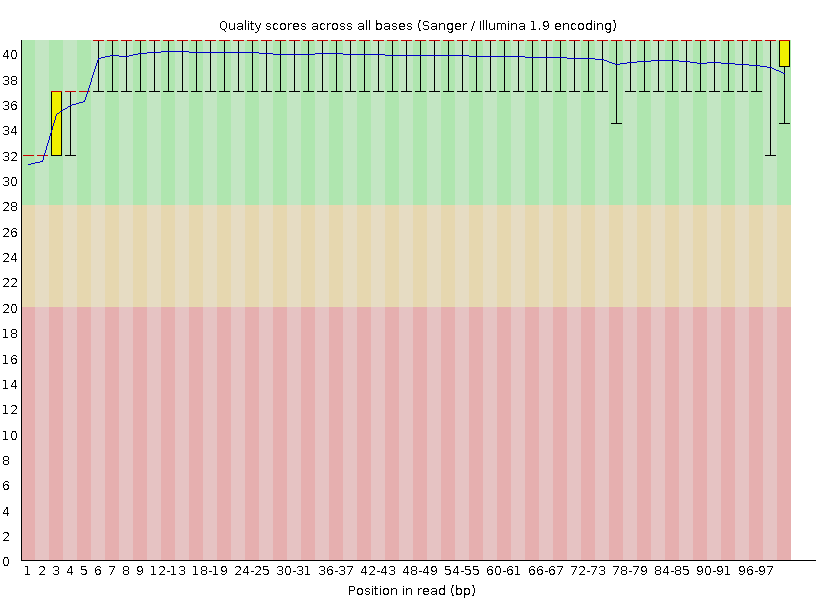
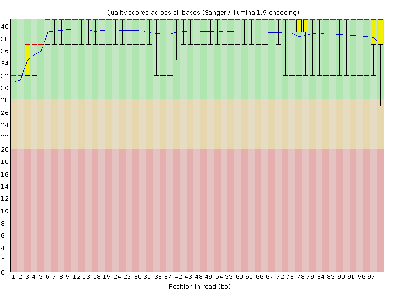
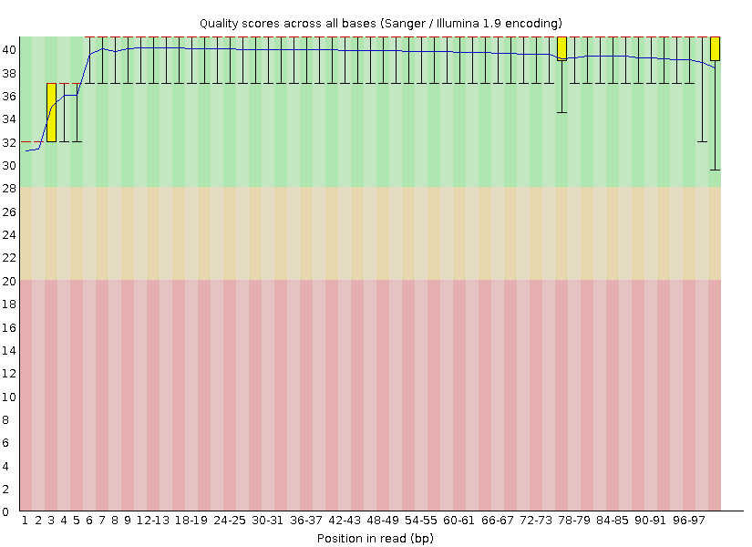
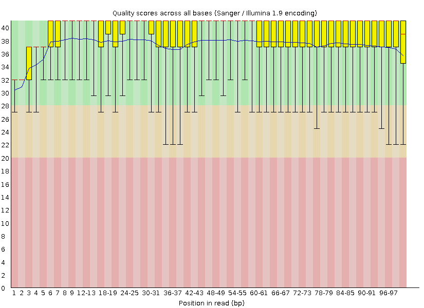
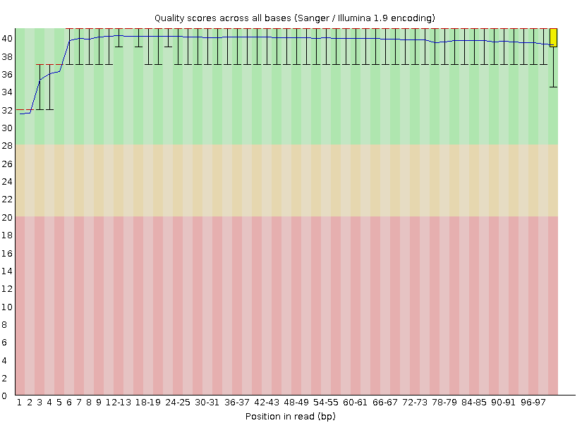
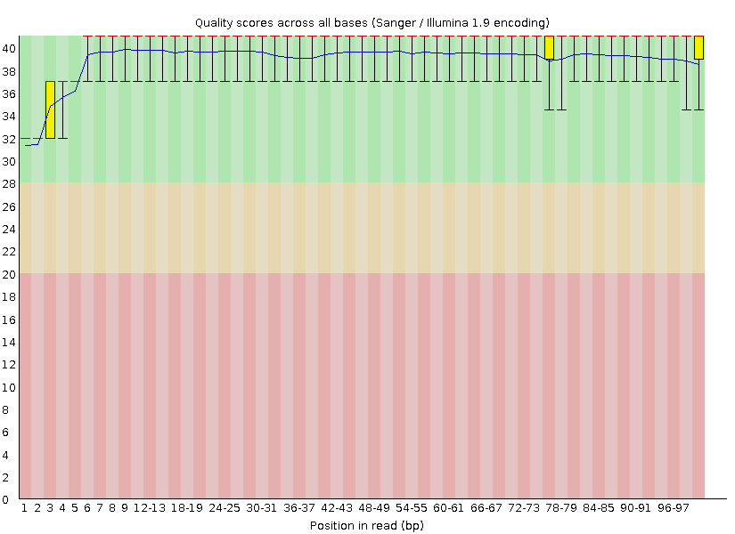
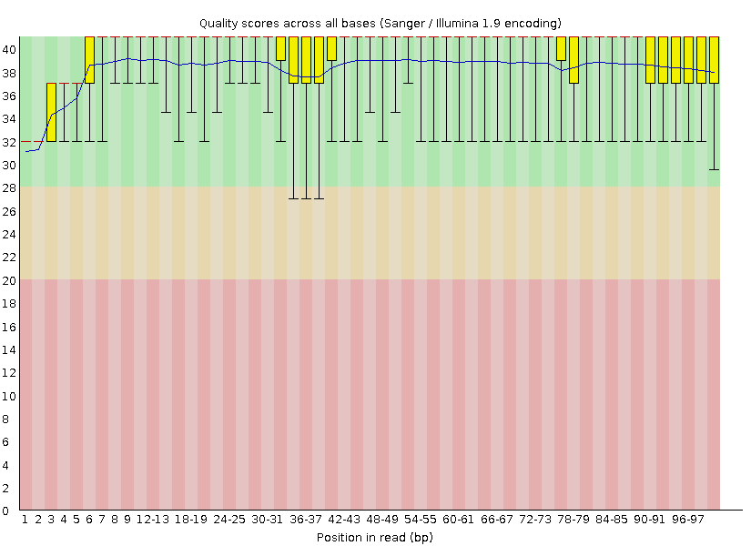

# BI623 RNA-seq Quality Assessment Assignment - Lab Notebook
Jules Hays
## Due: 9/13/24

Python version: 3.12.5

Environments used: QAA (fFastQC 0.12.1, Cutadapt 4.9, Trimmomatic 0.39, Matplotlib 3.9.2, STAR 2.7.11b, NumPy 2.1.0, HTSeq 2.0.5, Samtools 1.6)

__File directory__

```counts_files/```:
* 6_stranded.genecount - ht_seq output for file pair 6_2D_mbnl_S5_L008, ```stranded = yes```
* 6_reverse.genecount - ht_seq output for file pair 6_2D_mbnl_S5_L008, ```stranded = reverse```
* 16_stranded.genecount - ht_seq output for file pair 16_3D_mbnl_S12_L008, ```stranded = yes```
* 6_reverse.genecount - ht_seq output for file pair 16_3D_mbnl_S12_L008, ```stranded = reverse```


```fastqc_plots/```:
* 6_R1/ - FastQC plots for 6_2D_mbnl_S5_L008_R1_001.fastq.gz
* 6_R2/ - FastQC plots for 6_2D_mbnl_S5_L008_R2_001.fastq.gz
* 6_R1/ - FastQC plots for 16_3D_mbnl_S12_L008_R1_001.fastq.gz
* 6_R1/ - FastQC plots for 16_3D_mbnl_S12_L008_R2_001.fastq.gz
* html FastQC plot output also included for each file


```fastqc_trimmed_plots/```:
* trimmed_6_R1/ - FastQC plots for trimmed 6_2D_mbnl_S5_L008_R1_001.fastq.gz
* trimmed_6_R2/ - FastQC plots for trimmed 6_2D_mbnl_S5_L008_R2_001.fastq.gz
* trimmed_6_R1/ - FastQC plots for trimmed 16_3D_mbnl_S12_L008_R1_001.fastq.gz
* trimmed_6_R1/ - FastQC plots for trimmed 16_3D_mbnl_S12_L008_R2_001.fastq.gz
* html FastQC plot output also included for each file


```metadata/``` - experimental information about the sample data


```python_scripts```:
* qual_dist.py - plots the quality score per base of reads (Part 1)
* read_len_dist.py - plots the read length dist of paired trimmed and filtered reads (Part 2)
* sam_parse.py - counts the number of mapped and unmapped reads from the STAR alignment output SAM files (Part 3)
* bioinfo.py - I used the convert_phred function from this script in qual_dist.py


```qual_plots```:
* 6_R1_dist.png - quality distribution plot for 6_2D_mbnl_S5_L008_R1_001.fastq.gz from qual_dist.py
* 6_R2_dist.png - quality distribution plot for 6_2D_mbnl_S5_L008_R2_001.fastq.gz from qual_dist.py
* 16_R1_dist.png - quality distribution plot for 16_3D_mbnl_S12_L008_R1_001.fastq.gz from qual_dist.py
* 16_R2_dist.png - quality distribution plot for 16_3D_mbnl_S12_L008_R2_001.fastq.gz from qual_dist.py


```read_len_plots```:
* read_len_dist_6.png - read length distribution of adaptor and quality trimmed reads from 6_2D_mbnl_S5_L008
* read_len_dist_16.png - read length distribution of adaptor and quality trimmed reads from 16_3D_mbnl_S12_L008


```sbatch_scripts```:
* run_qual_dist.sh - runs qual_dist.py for each file in both pairs (Part 1)
* run_cutadapt.sh - runs cutadapt, once per pair, to cut adaptor regions from the reads (Part 2)
* run_trimmomatic.sh - runs trimmomatic, once per pair, to cut low quality regions from the reads (Part 2)
* run_readlen_dist.sh - runs read_len_dist.py, once per pair (Part 2)
* run_star_genomegen.sh - runs STAR genomeGenerate once to generate an alignment database from the Mus Musculus genome (Part 3)
* run_star_align.sh - runs STAR alignReads once per pair to align the filtered and trimmed reads to the generated database (Part 3)
* run_htseq.sh - runs htseq-count, once stranded for each pair and once reverse stranded for each pair, to count the reads that map to features (Part 3)

```QAA-Report.pdf``` - final report

```lab_notebook.md``` - Lab notebook for QAA assignment


---
### 8/24/24
Despite Leslie telling me not to be scared, I'm scared.

I logged into Talapas, navigated to my Bi623 directory, and cloned the repository. The repository is located at the following path:
```
/projects/bgmp/jkhay/bioinfo/Bi623/QAA
```
I then copied the Github QAA repo using my GitHub token. The repo is found at the following link: https://github.com/julhays/QAA

I started an interactive session on Talapas:
```
$ srun --account=bgmp --partition=bgmp --time=3:00:00 --pty bash
```

Next I am going to locate my data. The assignments for the demultiplexed file pair I will be working with is located in a file that I viewed with the following command:
```
cat /projects/bgmp/shared/Bi623/QAA_data_assignments.txt
```

Copying and pasting from this file, my assignments are the following:
```
Jules   16_3D_mbnl_S12_L008     6_2D_mbnl_S5_L008
```
These 2 files should each have a read 1 and read 2 of the index - a total of 4 files to analyze.

The files are located at the followng paths, with an arrow pointing to what I will refer to each graph as in my file naming:
```
/projects/bgmp/shared/2017_sequencing/demultiplexed/16_3D_mbnl_S12_L008_R1_001.fastq.gz -> 16_R1
/projects/bgmp/shared/2017_sequencing/demultiplexed/16_3D_mbnl_S12_L008_R2_001.fastq.gz -> 16_R2
/projects/bgmp/shared/2017_sequencing/demultiplexed/6_2D_mbnl_S5_L008_R1_001.fastq.gz -> 6_R1
/projects/bgmp/shared/2017_sequencing/demultiplexed/6_2D_mbnl_S5_L008_R2_001.fastq.gz -> 6_R2
```
As per the instruvtions, I will not move, copy or unzip the files and instead will reference them by path and use zcat. Lets perform some initial data exploration.

File size:
```
$ ls -lah /projects/bgmp/shared/2017_sequencing/demultiplexed/
-rw-r-----+ 1 coonrod is.racs.pirg.bgmp 468M Sep  1  2020 16_3D_mbnl_S12_L008_R1_001.fastq.gz
-rw-r-----+ 1 coonrod is.racs.pirg.bgmp 452M Aug 23  2017 16_3D_mbnl_S12_L008_R2_001.fastq.gz
-rw-r-----+ 1 coonrod is.racs.pirg.bgmp 571M Aug 23  2017 6_2D_mbnl_S5_L008_R1_001.fastq.gz
-rw-r-----+ 1 coonrod is.racs.pirg.bgmp 653M Aug 23  2017 6_2D_mbnl_S5_L008_R2_001.fastq.gz
```
Ok they are each about 400-600 Mb zipped.

Find number of lines:
```
$ zcat /projects/bgmp/shared/2017_sequencing/demultiplexed/16_3D_mbnl_S12_L008_R1_001.fastq.gz | wc -l
    32940788
$ zcat /projects/bgmp/shared/2017_sequencing/demultiplexed/16_3D_mbnl_S12_L008_R2_001.fastq.gz | wc -l
    32940788
$ zcat /projects/bgmp/shared/2017_sequencing/demultiplexed/6_2D_mbnl_S5_L008_R1_001.fastq.gz | wc -l
    44112976 
$ zcat /projects/bgmp/shared/2017_sequencing/demultiplexed/6_2D_mbnl_S5_L008_R2_001.fastq.gz | wc -l
    44112976
```
Divide these by 4 to get number of records:
```
16_3D_mbnl_S12_L008 - 8,235,197
6_2D_mbnl_S5_L008 - 11,028,244
```
The R1 and R2 files for each pair have the same number of lines/records, which is a good sign.

Read length:
```
$ zcat <filename> | sed -n '2~4p' | awk '{print length($0)}' | uniq
```
They all have a read length of 101 which is what was expected.

I also checked the Phred encoding on each file by running the following command for each file
```
zcat <filepath> | sed -n '4~4p' | head
```
Since all files contained symbols like '#' and '<', it is Phred+33 encoding.

In addition to these stats, I also investigated the headers of my files to see what the barcodes were and if they were quality filtered when they were demultiplexed.
```
$zcat /projects/bgmp/shared/2017_sequencing/demultiplexed/16_3D_mbnl_S12_L008_R1_001.fastq.gz | head
@K00337:83:HJKJNBBXX:8:1101:4797:1191 1:N:0:NCGATCAG+NTGATCGT
$ zcat /projects/bgmp/shared/2017_sequencing/demultiplexed/16_3D_mbnl_S12_L008_R2_001.fastq.gz | head
@K00337:83:HJKJNBBXX:8:1101:4797:1191 2:N:0:NCGATCAG+NTGATCGT
$ zcat /projects/bgmp/shared/2017_sequencing/demultiplexed/6_2D_mbnl_S5_L008_R1_001.fastq.gz | head
@K00337:83:HJKJNBBXX:8:1101:1935:1191 1:N:0:NAGCCATG+NATGGCTA
$ zcat /projects/bgmp/shared/2017_sequencing/demultiplexed/6_2D_mbnl_S5_L008_R2_001.fastq.gz | head
@K00337:83:HJKJNBBXX:8:1101:1935:1191 2:N:0:NAGCCATG+NATGGCTA
```
It appears that the barcodes for both sets of my files contain an N, so the barcodes were not thrown out for containing an N like how we demultiplexed the files. This likely means the barcodes weren't quality checked either, so these could potentially be low quality barcodes.

Below is a summary table of my initial data analysis:

| File | size (M) | # lines | # records | read_len | Phred encoding | fw_barcode | rev_barcode
|---|---|---|---|---|---|---|---|
| 16_R1 | 468 | 32,940,788 | 8,235,197 | 101 | Phred+33 | NCGATCAG | NTGATCGT |
| 16_R2 | 452 | 32,940,788 | 8,235,197 | 101 | Phred+33 | NCGATCAG | NTGATCGT |
| 6_R1 | 571 | 44,112,976  | 11,028,244 | 101 | Phred+33 | NAGCCATG | NATGGCTA |
| 6_R2 | 653 | 44,112,976  | 11,028,244 | 101 | Phred+33 | NAGCCATG | NATGGCTA |


The files look good to continue with quality analysis.


### Part 1 - Read quality score ditributions
Goal: Install and use FastQC for quality assessment of demultiplexed RNA-seq files, compare the quality assessments to those from my own software.

I started an interactive session on Talapas:
```
$ srun --account=bgmp --partition=bgmp --time=3:00:00 --pty bash
```

I made a new conda environment called ```QAA``` and installed FastQC into it with the following commands:
```
$ conda create --name QAA python=3.12
$ conda activate QAA
$ conda install fastqc
$ fastqc --version                    
FastQC v0.12.1
```

Time to use FastQC. I will use the following FastQc manual and tutorial for help:

https://home.cc.umanitoba.ca/~psgendb/doc/fastqc.help

https://hbctraining.github.io/Intro-to-ChIPseq/lessons/02_QC_FASTQC.html

First we will use FastQC to make graphs about each fastq file such as a per-base quality score distribution for R1 and R2 reads of each pair, and per-base N content for each file.

I will run fastqc on all 4 files:
```
/usr/bin/time -v fastqc -o fastqc_out -t 4 /projects/bgmp/shared/2017_sequencing/demultiplexed/16_3D_mbnl_S12_L008_R1_001.fastq.gz /projects/bgmp/shared/2017_sequencing/demultiplexed/16_3D_mbnl_S12_L008_R2_001.fastq.gz /projects/bgmp/shared/2017_sequencing/demultiplexed/6_2D_mbnl_S5_L008_R1_001.fastq.gz /projects/bgmp/shared/2017_sequencing/demultiplexed/6_2D_mbnl_S5_L008_R2_001.fastq.gz
```
The -t specifies the number of cores which my source said to do 1 per file, which is why I did 4. -o specifies the name of the output directory.

It ran succesfully and took 2 minute 49 seconds and 99% CPU to run all 4 files. My fastqc outputs for each file are located in ```fastqc_out``` directory. I unziped each of the zip files into their own directories, 1 for each file named after the file, using the following commands:
```
$ unzip fastqc_out/16_3D_mbnl_S12_L008_R1_001_fastqc.zip
$ unzip fastqc_out/16_3D_mbnl_S12_L008_R2_001_fastqc.zip
$ unzip fastqc_out/6_2D_mbnl_S5_L008_R1_001_fastqc.zip 
$ unzip fastqc_out/6_2D_mbnl_S5_L008_R2_001_fastqc.zip 
```

I also moved the plots only and html files for each file into a separate directory called ```fastqc_plots``` that I will use the paths for in my notebook here and push to github as well.

Below I will paste the resulting plots for each file.

| File name | per_base_qual | per_base_n |
|---|---|---|
| 16_R1 |  |  |
| 16_R2 |  |  |
| 6_R1 |  |  |
| 6_R2 |  |  |


__Produce plots of the per-base N content, and comment on whether or not they are consistent with the quality score plots.__

The per base quality score distribution is consistant with the per base n content plot in all 4 files because there's a small spike in n content at the beginning of the reads and it looks like the quality score of the beginning the reads is lower than the rest of the read.

Now, I will run these files through my own script ```qual_dist.py``` to calculate quality score distribution to see if it is similar to FastQC's distribution. To do this, I copied the python script I used to do this, plus the slurm script to run it, in the Demultiplex assignment using the below commands. I also needed ```bioinfo.py``` since my script used it for the ```convert_phred``` function.
```
$ cp /projects/bgmp/jkhay/bioinfo/Bi622/
Demultiplex/Assignment-the-first/qual_dist.py .
$ cp /projects/bgmp/jkhay/bioinfo/Bi622/Demultiplex/Assignment-the-first/R1_dist.sh .
$ cp /projects/bgmp/jkhay/bioinfo/Bi622/Demultiplex/Assignment-the-first/bioinfo.py .
```
I am going to read through these scripts to make sure no changes need to be made to suit my purposes. I changed the name of the R1_dist.sh to ```run_qual_dist.sh``` because I am going to use to to run all my files through at once since they aren't as big as the files we had in Demux. I changed one thing - my naming scheme for my graph output was different in the Demux assignment and I had just used a regex to get if the file was R1, R2, R3, or R4. Since this is no longer applicable i am just going to add another argparse parameter for the output file name and title of the distribution plot.

Time to run  ```run_qual_dist.sh```.
```
$ sbatch run_qual_dist.sh 
Submitted batch job 15875460
```
It succesffully ran, but it took a long time. If I do this again I will use 4 separate slurm scripts so I can run all 4 files in parallel. It took about 4-6 minutes per file for a total of 20 minutes and 8 seconds. Each run took about 99% CPU. The err and out files are in my ```Logs``` directory.

Below is a table to compare the per base average quality score of the 4 files:
| File name | fastq_per_base_qual | my_per_base_qual |
|---|---|---|
| 16_R1 |  |  |
| 16_R2 |  |  |
| 6_R1 |  |  |
| 6_R2 |  |  |

Here is a summary of runtime stats:
| Method | Runtime | Number of Cores | CPU Usage |
|---|---|---|---|
| FastQC | 2 minutes 49 seconds | 1 | 99% |
| qual_dist.py | 20 minutes 8 seconds | 8 | 99% |

__Describe how the FastQC quality score distribution plots compare to your own. If different, propose an explanation. Also, does the runtime differ? Mem/CPU usage? If so, why?__

The quality score distribution plots look very similar between the 2 methods. One obvious difference between the 2 plots is the the FastQC generated plot it gives more information about the distribution of quality scores for each nucleotide position than my plot. The red line shows the median, the yellow box shows the IQR, the upper and lower wisker give the 10% and 90% points, and the blue line gives the mean [1]. My plot only shows the mean for a given position, so I can compare the blue "mean" line with my plots. The lines for means appear to follow the same pattern, spiking and dipping in the same nucleotide positions, the dips and spikes are just less dramatic in the FastQC plots because the y-axis ranges from 0 to 40 whereas mine ranges from 30 to 40. The FastQC plots also show some guidelines with the red, orange, and green color zones to show what should be considered as a cutoff for 'good' quality, whereas my graph does not give any information about a cutoff. The FastQC plots are binned into 2 nucleotide groups, whereas my plots show a continuous distribution. This binning could potentially cause a loss of data. Finally, for my 4th file specifically, ```6_2D_mbnl_S5_L008_R2_001.fastq.gz```, the FastQC plot brings attention to some lower quality data: a dip in lower quartile/10% quality scores around bp 30-40, as well as a dip in lower quartile/10% quality at the end of the read from base pair 55 onwards. This means that there are some reads in the bottom 25% that are at or below the green cutoff of 28 in large sections of the read. My plot only shows the impact of these lower quality reads on the mean, which causes a small dip from about 38 to 36. I wouldn't think to throw out any reads based on my plot, but after seeing the FastQC  plot, I believe there are some lower quality reads in the ```6_2D_mbnl_S5_L008_R2_001.fastq.gz``` file that should be thrown out.

In terms of runtime, in addition to providing a more in depth analysis of the quality score distribution, FastQC also ran through all 4 files 10 times faster than my python script did (see above runtime comparison table). Additionally, the 2 methods used the same % of CPU but FastQC uses multithreading to spread the compuation over multiple cores. Overall, FastQC provides a better analysis of quality distribution and is faster and more efficient.

Some reasons that FastQC might be so much better in performance and faster than my python script is FastQC is a java application [2], and java code runs faster than python code because java does not need go through an interpretation step like python does. Additionally, FastQC was first released in 2010 so has had many years and likely teams of people to optimize it, whereas my code was developed a couple weeks ago by 1 grad student who is new to bioinfomatics. Therefore, it makes sense why FastQC is better in every way.

source: [1] https://www.bioinformatics.babraham.ac.uk/projects/fastqc/Help/3%20Analysis%20Modules/2%20Per%20Base%20Sequence%20Quality.html
[2] https://www.bioinformatics.babraham.ac.uk/projects/fastqc/INSTALL.txt#:~:text=Installing%20FastQC%20%2D%2D%2D%2D%2D,Runtime%20Environment%20(JRE)%20installed.

__Comment on the overall data quality of your two libraries. Go beyond per-base qscore distributions. Make and justify a recommendation on whether these data are of high enough quality to use for further analysis.__

In terms of the overall quality of my two libraries, I belive they are high enough quality to continue with further analysis. The per base quality for 3 of the 4 files looks great, with all the means and lower 10th percentiles in the green range. The file with a questionable per base quality, file 6_R2, the means are all in the green zone but the lower quartile and 10th percentile dip into the yellow zone. Therefore, there are some low quality reads in this file that will likely need to be trimmed out. In terms of per base n contenct, all four files look good. There is just a small increase less than a percent or two in N content at the beginning position of the read for each file but then it tapers off to close to 0%, but this it to be expected since the beginning of a read in Illumina will be slightly lower quality and have unknown calls as the machine orients itself. The per base sequence quality score plots also look good, increasing gradually from a quality score of 30 to 38, then spiking sharply up from 38-40. This shows that a majority of the reads have an average quality between 38 and 40, which is good. The only graph that is different in in 6_R2 the gradual increase starts at a score of 20, and then the graph spikes at a score of 36-40. This means that a majority of the reads for this file are between 36 and 40 and there's some reads below 30, which is consistant with the ber base quality for that file. The per base GC content distribtuion looks roughtly normal for all 4 files, indicating that the library was not biased. For sequence length distribution, all of the reads are 101 base pairs which is what was expected. There seems to be a lot of duplication within these files. For 6_R1 there is a spike in percentage of reads with >10 duplicates and when duduplicated, there will be 47% of the reads remaining. There is a similar spike in the remaining files, with percentages after deduplication of 58%, 59%, and 62% for 6_R2, 16_R1, and 16_R2, respectively. This duplication could indicate PCR overamplification for this RNA-seq library, but also isn't too much of a concern because it could also just be the the transcript was duplicated in the organism since its RNA data. Adaptor content is low for file pair 6, but spikes from bp 60 onwards for file pair 16. But this spike should be okay to continue with since adaptors will be removed in further processing.

Based on the results from all these plots, I recommend that these 2 files pairs are high enough quality to use for further analysis, which caution placed on file 6_R2 (```6_2D_mbnl_S5_L008_R2_001.fastq.gz```). It is likely that low quality reads will need to be trimmed out of this file based on the FastQC results.


Questions:
* did you do a quality cutoff to make these demuxed files?
 barcodes have N's, didn't throw barcodes out based on quality, I will add this to my data exploration


### Part 2 - Adaptor trimming comparison
Goal: Perform adaptor and quality trimming with existing tools cutadapt and Trimmomatic. 

First, I will install cutadapt and Trimmomatic into my QAA conda environment:
```
$ mamba install cutadapt=4.9
$ cutadapt --version
4.9
$ mamba install trimmomatic=0.39
$ trimmomatic -version
0.39
```
Now I will use cutadapt to trim adaptor sequences from my files.


__Try to determine what the adapters are on your own.__
Based on the metadata information, the libraries were prepared with KAPA's Stranded mRNA-seq kit. In the information for the kit, it states that the kit is compatible with adaptors used in Illumina TruSeq [1]. According to Illumina, the adaptor sequences used for TruSeq are [2]:

Read 1: AGATCGGAAGAGCACACGTCTGAACTCCAGTCA
Read 2: AGATCGGAAGAGCGTCGTGTAGGGAAAGAGTGT


source: 
[1] “KAPA Stranded RNA-Seq Kits,” Sequencing, 2024. https://sequencing.roche.com/us/en/products/group/kapa-stranded-rna-seq-kits.html (accessed Sep. 08, 2024).

[2] “IDT for Illumina–TruSeq DNA and RNA UD Indexes,” Illumina.com, 2023. https://support-docs.illumina.com/SHARE/AdapterSequences/Content/SHARE/AdapterSeq/TruSeq/UDIndexes.htm (accessed Sep. 08, 2024).
‌
__Sanity check: Use your Unix skills to search for the adapter sequences in your datasets and confirm the expected sequence orientations. Report the commands you used, the reasoning behind them, and how you confirmed the adapter sequences.__

Sanity check: I will use bash commands to find the adaptor sequences. I did this with both file sets to confirm the adaptor sequences.
```
zcat /projects/bgmp/shared/2017_sequencing/demultiplexed/16_3D_mbnl_S12_L008_R1_001.fastq.gz | grep "AGATCGGAAGAGCACACGTCTGAACTCCAGTCA" | head | less -p "AGATCGGAAGAGCACACGTCTGAACTCCAGTCA"
zcat /projects/bgmp/shared/2017_sequencing/demultiplexed/16_3D_mbnl_S12_L008_R2_001.fastq.gz | grep "AGATCGGAAGAGCGTCGTGTAGGGAAAGAGTGT" | head | less -p "AGATCGGAAGAGCGTCGTGTAGGGAAAGAGTGT"
```

To confirm the expected adaptor sequence orientations, I searched for the read 1 adaptor sequence at the ends of the read 1 files in each pair, and the read 2 adaptor sequence at the end of the read 2 pairs. First, grepping the adators pulls the reads with the adaptors in them. Then, I head the files to only output ten lines, and use less -p to highlight the adaptor sequence to see its position within the sequence. It makes sense that the adaptors are at the 3' end of the read because adaptors will only be included in the read if the insert length is less than the read length, causing the polymerase to read beyond the insert into the adaptor sequence.


Time to run cutadapt. I will use the following cutadapt command template:
```
cutadapt -a ADAPTER_FWD -A ADAPTER_REV -o out.1.fastq -p out.2.fastq reads.1.fastq reads.2.fastq
```
-a is the R1 adaptor sequence. -A is the R2 adaptor sequence. -o is the R1 output file. -p is the R2 output file. To run this on all my files, I put a command for each file pair into an sbatch script called ```run_cutadapt.sh``` and ran it.
```
$ sbatch run_cutadapt.sh 
Submitted batch job 15883794
```
The err and stout for this run is located in my ```Logs``` directory. The output files are located in the ```cutadapt_out``` directory.

Pair 16 Run Summary:
* 50 seconds to run, 6.166 µs/read
* used 98% CPU and 1 core
* Total read pairs processed: 8,235,197
* Read 1 with adapter: 1,002,983 (12.2%)
* Read 2 with adapter: 1,069,893 (13.0%)
* Pairs written (passing filters): 8,235,197 (100.0%)
* Total base pairs written (filtered):  1,627,540,628 bp (97.8%)
    * Read 1:   813,886,317/831,754,897 bp
    * Read 2:   813,654,311/831,754,897 bp
* Apdator 1 trimmed 1002983 times
* Adaptor 2 trimmed 1069893 times

Pair 6 Run Summary:
* 54 seconds to run, 4.904 µs/read
* used 98% CPU and 1 core
* Total read pairs processed: 11,028,244
* Read 1 with adapter: 416,045 (3.8%)
* Read 2 with adapter: 502,045 (4.6%)
* Pairs written (passing filters): 11,028,244 (100.0%)
* Total base pairs written (filtered):  2,220,049,445 bp (99.7%)
    * Read 1:   1,110,205,328/1,113,852,644 bp
    * Read 2:   1,109,844,117/1,113,852,644 bp
* Apdator 1 trimmed 416045 times
* Adaptor 2 trimmed 502045 times

__What proportion of reads (both R1 and R2) were trimmed?__

| File Pair | Read | Percent Trimmed |
|---|---|---|
| 6 | Read 1 | 3.8% |
| 6 | Read 2 |  4.6% |
| 16 | Read 1 | 12.2% |
| 16 | Read 2 |  13.0% |


---
### 8/26/24
### Part 2 cont
Now I will use Trimmomatic to quality trim my reads. I am going to write an sbatch script to run trimmomatic called ```run_trimmomatic.sh```.

I will use the following trimmomatic command template:
```
trimmomatic PE \
    <R1_file> <R2_file> \
    R1_paired_filtered.fastq.gz \
    R1_unpaired_filtered.fastq.gz \
    R2_paired_filtered.fastq.gz \
    R2_unpaired_filtered.fastq.gz \
    LEADING:3 \
    TRAILING:3 \
    SLIDINGWINDOW:5:15 \
    MINLEN:35
```
* PE specifies parired end files
* LEADING is the threshold to remove low quality bases from the beginning of a read
* TRAILING is the threshold to remove low quality bases from the end of a read
* SLIDINGWINDOW specific sliding window trimming, where is the average quality within a window of 5 nucleotides is below 15 it cuts them out
* MINLEN is the length cutoff to remove reads that are short after cutting from the file

I ran this script with the following command:
```
$ sbatch run_trimmomatic.sh 
Submitted batch job 15884020
```

The log output is in the ```Logs``` directory. The outputted files are in the ```trim_out``` directory.

16 Summary:
* used 4 threads and 211% CPU
* took 3 minutes 10 seconds
* Input Read Pairs: 8235197
* Both Surviving: 8014158 (97.32%)
* Forward Only Surviving: 189384 (2.30%)
* Reverse Only Surviving: 6913 (0.08%)
* Dropped: 24742 (0.30%)

6 Summary
* used 4 threads and 200% CPU
* took 4 minutes 23 seconds
* Input Read Pairs: 11028244
* Both Surviving: 10461303 (94.86%)
* Forward Only Surviving: 552941 (5.01%)
* Reverse Only Surviving:  7434 (0.07%)
* Dropped: 6566 (0.06%)

It makes sense that there was a higher percent of only forward surviving reads in the 6 file pair because the 6_R2 file was pretty low quality in my intial quality analysis.

Now, I will write a python script to plot the read length distributions for R1 and R2 reads for each file. It is called ```read_len_dist.py```.

To run the script, I needed to install ```matplotlib``` into my ```QAA``` environment
```
$ conda activate QAA
$ conda install matplotlib
```
I made a four unit test files by taking the first 100 lines from all my trim output files for the 6 files in a directory called ```unit tests```. I will test my script on those files with the following command:

```
/usr/bin/time -v ./read_len_dist.py -p1 'unit_test/test_R1_paired.fastq' -u1 'unit_test/test_R1_unpaired.fastq' -p2 'unit_test/test_R2_paired.fastq' -u2 'unit_test/test_R2_unpaired.fastq' -o 0
```

After asking Leslie, I learned that the unpaired reads should not be included in the read length distribution, so I will edit my script to remove the unpaired files input.

I ran my unit test again to make sure it worked with the following command:
```
/usr/bin/time -v ./read_len_dist.py -p1 'unit_test/test_R1_paired.fastq' -p2 'unit_test/test_R2_paired.fastq' -o 0
```

It works so I will run it on the actual files now. I made an sbatch script called ```run_readlen_dist.sh``` to run my script on the trimmomatic output files.

When I ran it at first, the graph was really difficult to see any differences in frequency because there were many reads at length 101, so all the lower lengths were difficult to compare. Therefore, I changed my my graph in my script to have a log scale y axis so that it is easier to see the differences between the 2 read files.

I ran it with the following command.
```
$ sbatch run_readlen_dist.sh 
Submitted batch job 15915619
```

Ok, it ran in 26 seconds and took 101% CPU for the 16 file pair, and it ran in 35 seconds and took 101% CPU for the 6 file pair. The resulting output graphs are in the ```read_len_plots``` directory, but I have also included them here.

| File pair | read_len_dist |
|---|---|
| 16 |  |
| 6 |  |

__Comment on whether you expect R1s and R2s to be adapter-trimmed at different rates and why.__

Based on the graphs, it appears that the R2 file was more extensively adaptor-trimmed because there are more reads from the R2 file with lengths shorter than 101. This may be due to a lower quality of read 2 from illumina sequencing because the cluster size of during the sequencing decreases during the bridge amplification at the paired-end turnaround stage [1] (or when preparing for R4 read). Therefore, it makes sense that read 2 got trimmed more in each file.

Source:  
[1] ecSeq Bioinformatics, “Why has the reverse read 2 a worse quality than the forward read 1 in Illumina sequencing?,” Ecseq.com, 2020. https://www.ecseq.com/support/ngs/why-has-reverse-read-a-worse-quality-than-forward-read-in-Illumina-sequencing (accessed Sep. 02, 2024).
‌

Questions:
* should we include the unpaired reads in our length distributions? - toss the unpiared, don't include them in plot

no unpaired reads bc we don't include them in downstream analysis

* trying to make figures longer to more readable, fig size causes plot to go all white

put fig size at top when making graphs, but generally you should not have to adjust it


---
### 9/2/24
### Part 3 - Alignment and strand-specificity
Goal: Align the quality trimmed reads to a publicly available mouse genome and determine counts of the genes within the reads.

I started an interactive session on Talapas:
```
$ srun --account=bgmp --partition=bgmp --time=3:00:00 --pty bash
```

First, I need to install more software into my QAA environment: star, numpy, and htseq (I have previously installed matplotlib).

```
$ conda activate QAA
$ conda install star -c bioconda
$ STAR --version 
2.7.10b
$ mamba update star
$ STAR --version 
2.7.11b

$ mamba install numpy
$ conda list
numpy 2.1.0

$ mamba install htseq
htseq 2.0.5 
```

Now, I will find the mouse genome fasta file and GTF file as a gene model to align to and download them with the following command:
```
wget https://ftp.ensembl.org/pub/release-112/fasta/mus_musculus/dna/Mus_musculus.GRCm39.dna_sm.primary_assembly.fa.gz
wget https://ftp.ensembl.org/pub/release-112/gtf/mus_musculus/Mus_musculus.GRCm39.112.gtf.gz
```

I am making a directory in my repo called ```Mus_musculus.GRCm39.dna.ens112.STAR_2.7.11b``` to contain my STAR mouse genome database. I will now use a STAR program to k-merize my reference sequence and build my STAR database. First I had to unzip my files:
```
gunzip Mus_musculus.GRCm39.dna_sm.primary_assembly.fa.gz
gunzip Mus_musculus.GRCm39.112.gtf.gz
```
I moved the unziped files into a directory called ```mmus_files```.

To run the genomeGenerate funtion I ran an sbatch script named ```run_star_genomegen.sh```
```
$ sbatch run_star_genomegen.sh 
Submitted batch job 15915788
```
The err file said "Sep 02 14:06:44 ..... finished successfully" so the run completed successfully. It took about 17 minutes and 45 seconds to run and used 530% CPU. The resultiing files are located in the ```Mus_musculus.GRCm39.dna.ens112.STAR_2.7.11b``` directory.

I then created an sbatch file to run star alignReads to align the trimmomatic output reads to the reference genome database named ```star_align_reads.sh ```. The star align command has the following format:
```
/usr/bin/time -v STAR --runThreadN 8 --runMode alignReads \
    --outFilterMultimapNmax 3 \
    --outSAMunmapped Within KeepPairs \
    --alignIntronMax 1000000 --alignMatesGapMax 1000000 \
    --readFilesCommand zcat \
    --readFilesIn R1_path.gz R2_path.gz\
    --genomeDir Mus_musculus.GRCm39.dna.ens112.STAR_2.7.11b \
    --outFileNamePrefix output_prefix
```
--outFilterMultimapNmax specifies the max number of multiple alignments allowed for a read before considering it unmapped. --outSAMunmapped Within KeepPairs will allow for inclusion of the unmapped reads in the output file. --alignIntronMax specifies the max intron length. --alignMatesGapMax specifies the max genomic distance between mates. --readFilesCommand zcat lets me input zipped files.

I will run this command once for each file pair with the paired trimmomatic output files located in the ```trim_out``` directory.
```
$ sbatch run_star_align.sh 
Submitted batch job 15916410
```
Both runs say "finished successfully" so this run completed successfully. Here are the stats for each run:

File pair | run time | %CPU | output file |
|---|---|---|---|
| 16 | 1 minute 14 seconds | 628% | ```16_Mus_Aligned.out.sam``` |
| 6 | 1 minute 40 seconds | 637% | ```6_Mus_Aligned.out.sam``` |

I threw all the output files into a directory called ```Mus_Aligned```.

Next, I will use my script from PS8 in Bi621. I copied the script from my ps8 directory to here using the following command:
```
cp /projects/bgmp/jkhay/bioinfo/Bi621/PS/ps8-julhays/sam_parse.py .
```

The file is called ```sam_parse.py```. This script will count up the number of reads that are properly mapped to the reference genome and the number of reads that are not mapped to the genome. I will update this file to add an argparse (as per my PS8 feedback from Bi621). Then, I will run it on both my star alignment outputs using the following commands:
```
/usr/bin/time -v ./sam_parse.py -f "Mus_aligned_out/6_Mus_Aligned.out.sam" -o 6
/usr/bin/time -v ./sam_parse.py -f "Mus_aligned_out/16_Mus_Aligned.out.sam" -o 16
```
__Using your script from PS8 in Bi621, report the number of mapped and unmapped reads from each of your 2 sam files.__

The commands outputted the following information:

File pair | run time | %CPU | # Mapped Reads | # Unmapped Reads | output file |
|---|---|---|---|---|---|
| 16 | 17 seconds | 98% | 15,662,583 | 365,733 | ```mapped_counts/16_mapped_reads.txt``` |
| 6 | 22 seconds | 98% | 20,186,291 | 736,315 | ```mapped_counts/6_mapped_reads.txt``` |

Next, I will count the reads that match to features with htseq-count. I am making an sbatch script called ```run_htseq.sh```. The template for the htseq command I will use is below:
```
/usr/bin/time -v htseq-count -f sam -r name --stranded=<> -c output <alignment_files> mmus_files/Mus_musculus.GRCm39.112.gtf
```
-f specifices the input files type. -r specifies the sortiing order for the paired ened data. --stranded=yes means the read has to be mapped to the same strand as the feature. This means the first read has to be on the same strand and the second read on the opposite strand. --stranded=reverse reveses these rules.

htseq-count needs a sorted sam file as input for paired data, so I need to sort by star align output by name. My STAR output files are unsorted. I know this because the first line is "@HD VN:1.4" and does not include an "SO:coordinate" field to specify that its sorted,, according to a source about SAM file format [1]. I need to install samtools first. I will use the following commands:
```
$ conda install samtools -c bioconda
$ conda update samtools
$ samtools --version
samtools 1.20
$ samtools sort -n Mus_aligned_out/6_Mus_Aligned.out.sam -o Mus_aligned_out/sorted_6_Mus_Aligned.out.sam
$ samtools sort -n Mus_aligned_out/16_Mus_Aligned.out.sam -o Mus_aligned_out/sorted_16_Mus_Aligned.out.sam
```
-n sorts alphanumerically. The resulting files have a "SO:queryname" in the first header line now, which means the files are sorted by name. Now the -r name flag in my htseq command will work.

Source: [1] “Sequence Alignment/Map Format Specification,” 2020. Available: https://samtools.github.io/hts-specs/SAMv1.pdf

So I actually ran htseq on both the sorted and unsorted files to see if there was a difference, and there was no difference (checked with ```diff file1 file2```).This means that STAR does automatically sort the output SAM files by query name. I will remember this for future runs of STAR and htseq-count (and its written here so I know I'll remember :smiley:)
‌
I ran ```run_htseq.sh``` on the original files with the following command:
```
$ sbatch run_htseq.sh 
Submitted batch job 15916703
```

Run summary:

File pair | stranded | run time | %CPU | output file |
|---|---|---|---|---|
| 16 | yes | 11 minutes 25 seconds | 99% | ```counts_files/16_stranded.genecount``` |
| 6 | yes | 14 minutes 35 seconds | 99% | ```counts_files/6_stranded.genecount``` |
| 16 | reverse | 11 minutes 46 seconds | 99% | ```counts_files/16_reverse.genecount``` |
| 6 | reverse | 14 minutes 47 seconds | 99% | ```counts_files/6_reverse.genecount``` |


To demonstrate whether or not the data is from a strand specific RNA-Seq library, I will determine the percentage of reads that got mapped to a feature in each file and see if strandedness being one way vs another makes a difference.

Fist, I will sum the number of reads that mapped to a feature in all the files:
```
$ cat counts_files/6_stranded.genecount | grep "ENSMU" | awk '{count+=$2} END {print count}'
360978
$ cat counts_files/6_reverse.genecount | grep "ENSMU" | awk '{count+=$2} END {print count}'
8607459
$ cat counts_files/16_stranded.genecount | grep "ENSMU" | awk '{count+=$2} END {print count}'
325575
$ cat counts_files/16_reverse.genecount | grep "ENSMU" | awk '{count+=$2} END {print count}'
6872907
```
Now, I will calculate the total number of reads in each genecount file:
```
$ cat counts_files/6_stranded.genecount | awk '{count+=$2} END {print count}'
10461303
$ cat counts_files/6_reverse.genecount | awk '{count+=$2} END {print count}'
10461303
$ cat counts_files/16_stranded.genecount | awk '{count+=$2} END {print count}'
8014158
$ cat counts_files/16_reverse.genecount | awk '{count+=$2} END {print count}'
8014158
```

Finally, I'll divide the total number of reads mapped by the total number of reads to determine the percentage of reads mapped in each file.

Here is a table to summarize those results:

File name | stranded= | mapped reads | total reads | % mapped |
|---|---|---|---|---|
| 6_stranded.genecount | yes | 360978 | 10461303 | 3.45 |
| 6_reverse.genecount | reverse | 8607459 | 10461303 | 82.28 |
| 16_stranded.genecount | yes | 325575 | 8014158 | 4.06 |
| 16_reverse.genecount | reverse | 6872907 | 8014158 | 85.76 |

As a note, the total number of reads is half in the ht-seq output compared to my script. I think this is due to the fact that htseq counts pairs of mapped reads, and my script counts each read separately in a pair

I propose that these data are strand-specific because there is a large difference in performance for when the stranded parameter is set to yes vs reverse. When set to yes, file sets 6 and 16 only mapped 3.45% and 4.06% of the reads to genes, respectively. When set to reverse, file sets 6 and 16 mapped 82% and 85% of the reads to genes, respectively. Therefore, since one orientation of mapping the reads to features performed better than another, we can conclude that the library is strand specific.

Strand-specific RNA-seq libraries are useful because you can tell which strand of cDNA corresponds back the the mRNA template. The template strand is used to transcribe the mRNA, and the non-template strand looks like the mRNA. In mRNA library prep, the 1st strand cDNA is used for sequencing and the 2nd strand mRNA is made of dUTP and gets broken down. Therefore, the 1st strand cDNA sequence will be R1, and 1st strand RC will be R4, or R2 after demultiplexing. In both sets of files, the ones with the stranded=reverse parameter had more mapped reads than the ones with the stranded=yes parameter. reverse=True means that the first read has to be on the opposite strand and the second reads has to be on the same strand. In Illumina stranded sequencing mRNA library prep, read 1 maps to the template strand and read 2 maps to the non-template strand.

source: https://knowledge.illumina.com/library-preparation/rna-library-prep/library-preparation-rna-library-prep-reference_material-list/000002238


---
### 9/3/24
### Writing the report

I'm dead R markdown is hard.


___
### 9/8/24
### Part 2 challenge
Goal: Run FastQC on the trimmed data to see if trimming improves the quality.

Ok, I am going to run FastQC again, but this time on my trimmed output, located at 
```
/projects/bgmp/jkhay/bioinfo/Bi623/QAA/trim_out/6_R1_paired_filtered.fastq.gz
/projects/bgmp/jkhay/bioinfo/Bi623/QAA/trim_out/6_R2_paired_filtered.fastq.gz
/projects/bgmp/jkhay/bioinfo/Bi623/QAA/trim_out/16_R1_paired_filtered.fastq.gz
/projects/bgmp/jkhay/bioinfo/Bi623/QAA/trim_out/16_R2_paired_filtered.fastq.gz
```
I am only using the paired output because this is what I used for further processing downstream.

I will run fastqc on all four files with the following command:
```
$ srun --account=bgmp --partition=bgmp --time=3:00:00 --pty bash
$ conda activate QAA
$ /usr/bin/time -v fastqc -o fastqc_trimmed_out -t 4 /projects/bgmp/jkhay/bioinfo/Bi623/QAA/trim_out/6_R1_paired_filtered.fastq.gz /projects/bgmp/jkhay/bioinfo/Bi623/QAA/trim_out/6_R2_paired_filtered.fastq.gz /projects/bgmp/jkhay/bioinfo/Bi623/QAA/trim_out/16_R1_paired_filtered.fastq.gz /projects/bgmp/jkhay/bioinfo/Bi623/QAA/trim_out/16_R2_paired_filtered.fastq.gz
```
The -t specifies the number of cores which my source said to do 1 per file, which is why I did 4. -o specifies the name of the output directory.

It ran succesfully and took 2 minute 40 seconds and 97% CPU to run all 4 files. My fastqc outputs for each file are located in ```fastqc_trimmed_out``` directory. I unziped each of the zip files into their own directories, 1 for each file named after the file, using the following commands:
```
$ unzip fastqc_trimmed_out/6_R1_paired_filtered_fastqc.zip
$ unzip fastqc_trimmed_out/6_R2_paired_filtered_fastqc.zip
$ unzip fastqc_trimmed_out/16_R1_paired_filtered_fastqc.zip 
$ unzip fastqc_trimmed_out/16_R2_paired_filtered_fastqc.zip
```

I also moved the plots only and html files for each file into a separate directory called ```fastqc_trimmed_plots``` that I will use the paths for in my notebook here and push to github as well.

Below I will paste the per base quality score and n content plots for each file.

| File name | per_base_qual | per_base_n |
|---|---|---|
| 16_R1 |  |  |
| 16_R2 |  |  |
| 6_R1 |  |  |
| 6_R2 |  |  |


__Comment on differences you observe between the trimmed and untrimmed data. Include any figures needed to support your conclusions.__

The trimmed files have an improved per-base quality score than the original files. For all files, the lower tenth percentile and lower quartile shifted up in quality, which in turn shifts the mean quality up as well. This is especially apparent in file pair 6, where some of the reads extended into the yellow, reasonable quality zone from base position 55 and onwards, but in the trimmed data the spread no longer extends into the reasonable quality zone and is in the good quality zone (green). This improvement is reasonable because low quality sequences were trimmed out.  The trimmed files also have an improved per-sequence quality score, specifically on the lower bound of mean sequence quality. The lower bound of sequence quality shifted up from 12 to 19 for the read 1 files and from 12 to 16 for the read 2 files. This shows that the trimming removed lower quality sequences from the files. Corresponding with the increase in per-base and sequence quality, the spike in the per-base N content early in the read decreased, showing that the quality filtering cut out any unknown base calls at the beginning of the reads. Finally, adaptor content reduced to zero and adaptor sequences are no longer overrepresented in the reads because the adaptors were filtereed.

A few of the FastQC analyses still raised a warning with the trimmed files. The per-tile sequence quality plots look nearly identical to the original files, except for a few regions of lighter blue became more darkly shaded, meaning these positions saw a slight increase in quality. The red regions (poor quality), however, still remained red. This may be because the color scale of the per-tile sequence quality plots is relative to the average quality for that base position in a run, so even if a lower quality position improved in quality, it might remain red because the overall mean quality shifted up as well. The per-base sequence content remained nearly identical to the original files, which means the adaptor filtering and quality trimming that was performed does not remove nucleotide composition biases at the beginning of a read. The sequence length distribution is no longer consistant at 101 base pairs because, as seen in the read length distribution plots (Figure X), many of the reads were adaptor and quality trimmed so are shorter now. Finally, there is still high duplication levels in the trimmed files, but this is to be expected since a transcript can appear multiple times in a sample. Interestingly, read 2 from pair 6 still has some overrepresented sequences. The two overrepresented sequences were run through the blast database, both matching to Mus musculus 18S ribosomal RNA (rRNA) genes. This indicates that the the messenger RNA (mRNA) extraction did not fully isolate the mRNA from other types of RNA as this sample was contaminated by rRNA.


### Metadata challenge
Goal: Tie the metadata into my analyses.

One interesting observation is that the indexes contained N in them. File pair 6 should have had ```TAGCCATG``` as a barcode, but instead had ```NAGCCATG```. File pair 16 should have had ```ACGATCAG``` but instead had ```NCGATCAG```. According to Illumina, many demultiplexing softwares treat N as a wild card charracter [1], so my files could contain barcodes with any character in place of the N. It is unlikely that incorrect indexes were added to these files regardless of the wildcard N because the rest of the index is enough nucleotides away from the other indexes.

Both of the samples analyzed in this report, 6 and 16, were MBNL treated. Sample 6 came from cell passage 2 and sample 16 came from cell passage 3.

Based on the description of the library prep, 300 to 400 is the expected fragment size. Both sample 6 and 16 contained contaminants around size 32 base pairs. These sequences could possibly be primer dimers. A majority of the library in both files was around the 300 to 500 base pair range in length. Sample 6 had an average fragment size of 441 base pairs and sample 16 had an average fragment size of 353 base pairs. Both of these lengths are within or near the target length range of 300-400 base pairs. Since sample 16 had a shorter average insert length, this could explain why sample 16 had a higher percentage of reads adaptor trimmed (Table 4), becase the shorter average insert length would imply that the insert length for more sequences is shorter than the read length so they would run into the adaptor sequence. Sample 16, however, has much less area in this peak compared to sample 6, which could explain why sample 16 had less records than sample 6. Overall, these libraries were high quality, likely because the fragments that generated them were the correct length with little contamination.

source: [1] “Using an N wildcard in index sequences in different Illumina FastQ generation software | Illumina Knowledge,” Illumina.com, 2019. https://knowledge.illumina.com/software/general/software-general-reference_material-list/000003560 (accessed Sep. 09, 2024).
‌

### 9/9/24
### Finishing the report and submitting

Ok the report is almost done and I'm getting things ready to submit. I put all my sbatch scripts into a direectory called ```sbatch_scripts```. I put all my python scripts in ```python_scripts```. I added a file directory at the top of this document that has information about each of the directories I'm pushing to Github. 

### Turn In Checklist

Upload your:
- [ x ] lab notebook,
- [ x ] Talapas batch script/code, 
- [ x ] FastQC plots, 
- [ x ] counts files generated from htseq-count (in a folder would be nice),
- [ x ] pdf report (see below), 
- [ x ] and any additional plots, code, or code output

to GitHub.
    
You should create a pdf file (using Rmarkdown) with a high-level report including:
- [ x ] all requested plots
- [ x ] answers to questions
- [ x ] mapped/unmapped read counts from PS8 script (in a nicely formatted table)

Everything is pushed except for the final report and the final lab notebook push.

Ok, I have uploaded my final report to GitHub and canvas. One final push of the lab notebook and then I'm all done.

Signing off. Byeeeee
